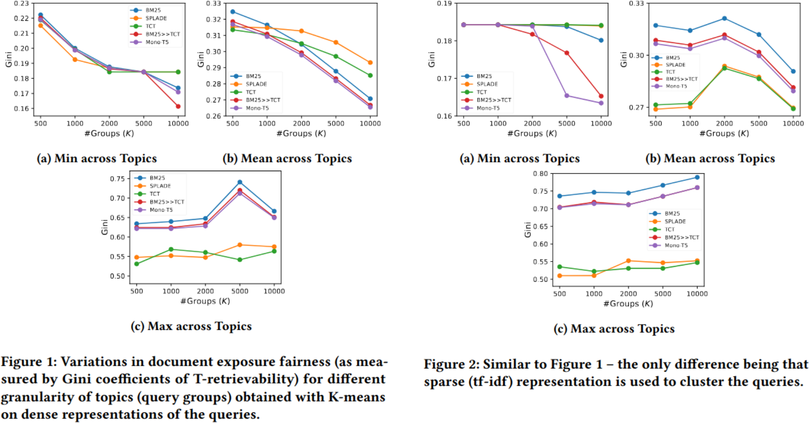

# T-Retrievability: A Topic-Focused Approach to Measure Fair Document Exposure in Information Retrieval
The paper proposed a localised retrievability measure to conduct a more nuanced analysis of document exposure fairness in Information Retrieval, compared to collection-level analysis.

<p align="center">
  
</p>

## Installation
We use Ubuntu 22.04.5 LTS, miniconda3(version 24.11.3), and python version 3.10.13

Using user's home directory is recommended. Otherwise, you need to change the directory configurations in config.py and plot.ipynb.
You need to run the following commands step by step.

```bash
# Due to package dependencies, you need to create two conda environments.
# Create an environment for Splade.
cd ./T-Retrievability
conda env create -f environment_splade.yml
# Create an environment for other models.
conda env create -f environment.yml 
```

```bash
# decompress TREC files. Note that there is enough disk space available. 
cd ./src
./decompress.sh
```

## Run

You can run the following python script to conduct collection-level Gini evaluation using retrieved TREC files in the directory "./trec_files". 
For example, the file "bm25_msmarco-passage_dev_100.res" was the retrieved TREC file by BM25, which contains 6 columns (query_id, Q0, doc_id, rank, score, run)
for top 100 ranked documents for each of the MS MARCO development queries.

```bash
python ./collection_eval.py "bm25_msmarco-passage_dev_100.res"
```

For topical Gini evaluation using the MS MARCO development queries clustered by the all-MiniLM-L6-v2 variant of SBERT.  

```bash
python ./topical_eval.py "bm25_msmarco-passage_dev_100.res" "clustered_dev_queries_by_5000_scikit_dense.csv"  
```

# Citation

This is the repository of the paper **T-Retrievability: A Topic-Focused Approach to Measure Fair Document Exposure in Information Retrieval** at CIKM 2025. Please cite: https://doi.org/10.1145/3746252.3760820.

```bibtex
@inproceedings{DBLP:conf/cikm/t-retrievability,
    will be availbe soon.
}
```
