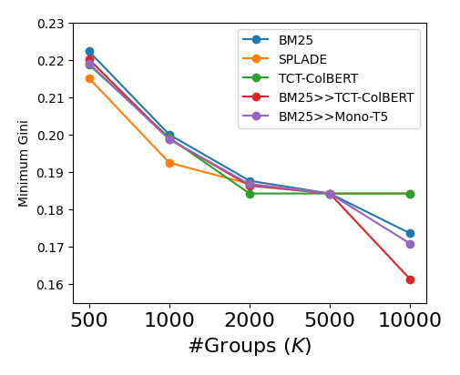
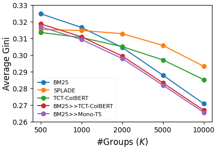
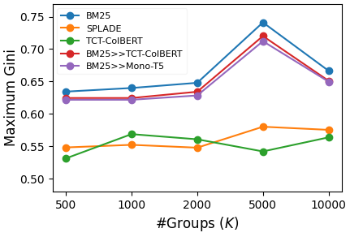
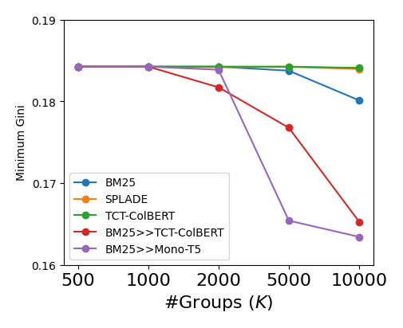
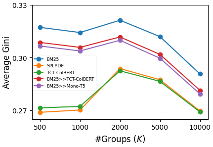
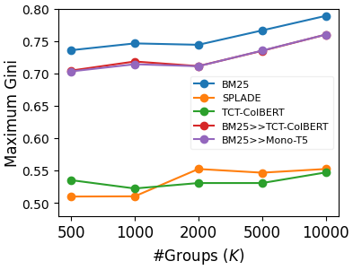

# T-Retrievability: A Topic-Focused Approach to Measure Fair Document Exposure in Information Retrieval

<p align="center">
  
  
</p>
<p align="center">
  
</p>

Figure 1: Variations in the aggregated exposure fairness using K-means with dense vector representations for different granularity of topics (query groups).

<p align="center">
  
  
</p>

<p align="center">
  
</p>

Figure 2: Variations in the aggregated exposure fairness using K-means with sparse tf-idf vectors for different granularity of topics (query groups).

## Installation
Using user's home directory is recommended. Otherwise, you need to check the configurations in config.py and plot.ipynb.

```bash
# Due to package dependencies, you need to create two conda environments.
# Create an environment for Splade.
conda env create -f environment_splade.yml
# Create an environment for other models.
conda env create -f environment.yml 
```

```bash
# decompress TREC files. Note that there is enough disk space. 
cd ./T-Retrievability/src
./decompress.sh
```

## Run

Collection-level Gini evaluation. For bm25:

```bash
python ./collection_eval.py "bm25_msmarco-passage_dev_100.res"
```

Topical Gini evaluation. For bm25:

```bash
python ./topical_eval.py "bm25_msmarco-passage_dev_100.res" "clustered_dev_queries_by_5000_scikit_dense.csv"  
```

# Citation

This is the repository of the paper **T-Retrievability: A Topic-Focused Approach to Measure Fair
Document Exposure in Information Retrieval** at CIKM 2025. Please cite:

```bibtex
https://doi.org/10.1145/3746252.3760820.

@inproceedings{DBLP:conf/cikm/t-retrievability,

}
```
